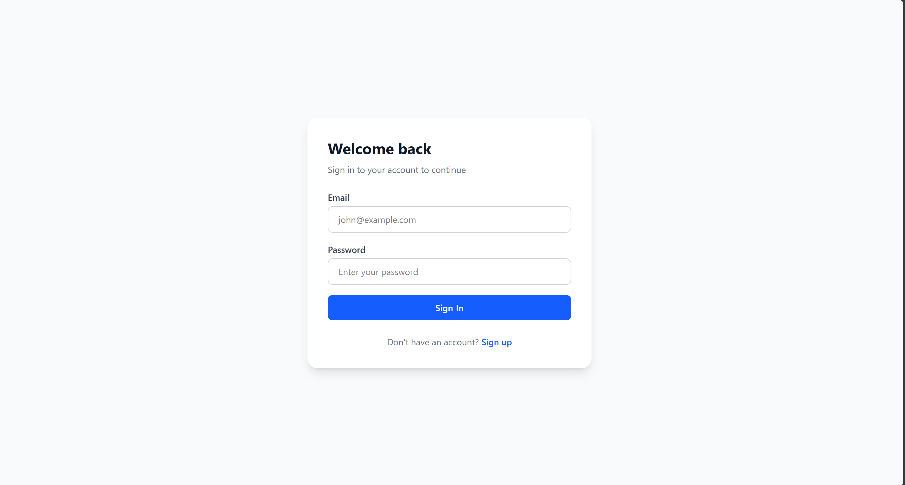
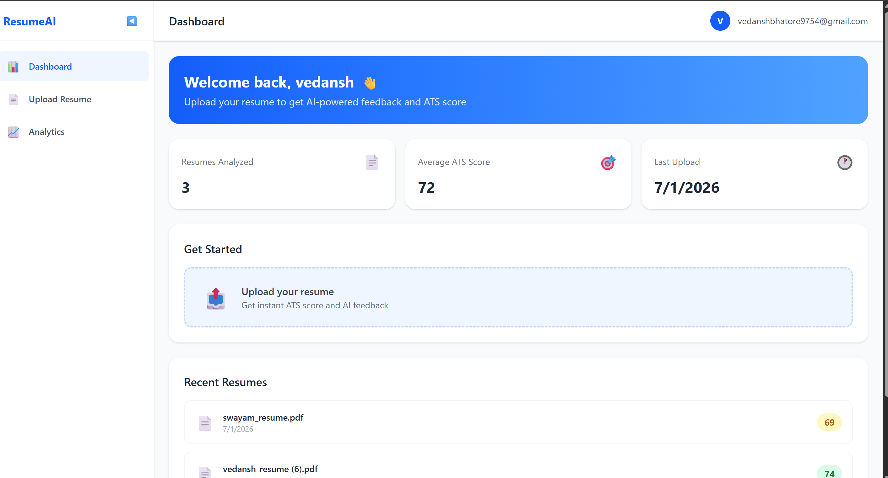
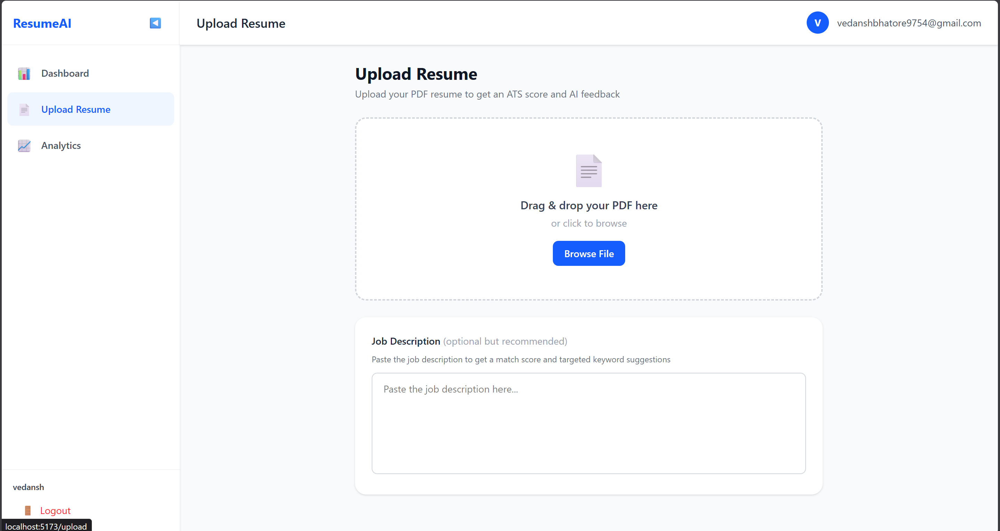
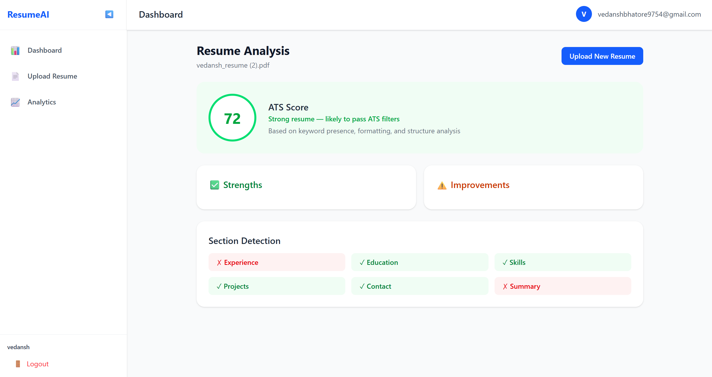
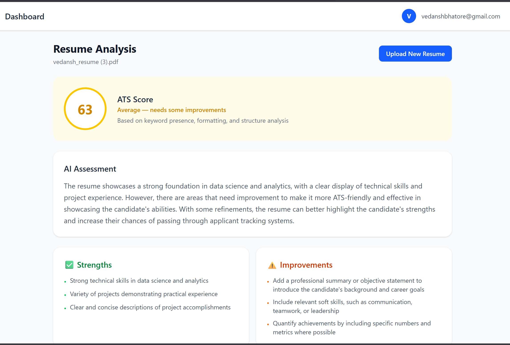
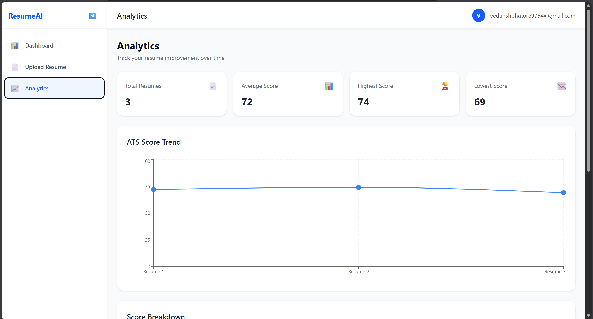
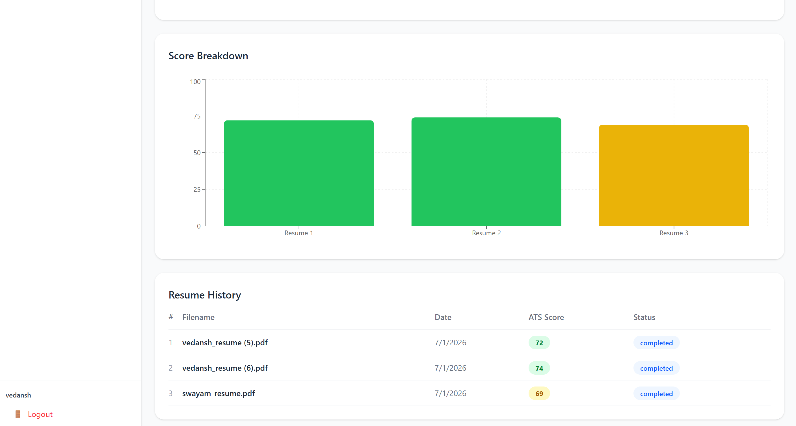

# 🤖 Hire Mate — AI ATS Resume Analyzer

A full-stack AI-powered resume analyzer that scores resumes against ATS (Applicant Tracking System) criteria and provides detailed feedback using Groq AI (Llama 3.3).

## 🌐 Live Demo
- **Frontend**: https://hire-mate-ai-resume-analyzer-rosy.vercel.app
- **Backend**: https://hire-mate-ai-resume-analyzer.onrender.com

## ✨ Features
- 🔐 JWT Authentication with httpOnly cookies
- 📄 PDF Resume Upload with drag & drop
- 🎯 ATS Score calculation (keyword detection, section analysis, formatting checks)
- 🤖 AI-powered feedback using Groq API (Llama 3.3)
- 💼 Job Description matching and keyword gap analysis
- 📊 Analytics dashboard with score trend charts (Recharts)
- 📱 Responsive design with Tailwind CSS

## 🛠️ Tech Stack

**Frontend:**
- React 19 + Vite
- Tailwind CSS v4
- React Router v7
- Axios
- Recharts

**Backend:**
- Node.js + Express 5
- MongoDB Atlas + Mongoose
- JWT + httpOnly Cookies
- Multer (file uploads)
- pdf-parse (PDF text extraction)
- Groq API / Llama 3.3 (AI analysis)

## 🏗️ Architecture
[React Frontend] <--HTTP/JSON--> [Express Backend] <--Mongoose--> [MongoDB Atlas]
|
v
[Groq API / Llama 3.3]

## 📸 Screenshots

### Login


### Dashboard


### Upload Resume


### Resume Analysis Result



### Analytics



## 🚀 Getting Started

### Prerequisites
- Node.js v18+
- MongoDB Atlas account
- Groq API key (free at console.groq.com)

### Installation

1. Clone the repository
```bash
git clone https://github.com/VedanshBhatore/Hire-Mate-AI-Resume-Analyzer.git
cd Hire-Mate-AI-Resume-Analyzer
```

2. Install backend dependencies
```bash
cd server
npm install
```

3. Create `server/.env`:
PORT=5000
MONGO_URI=your_mongodb_atlas_uri
JWT_SECRET=your_jwt_secret
NODE_ENV=development
CLIENT_URL=http://localhost:5173
GROQ_API_KEY=your_groq_api_key

4. Install frontend dependencies
```bash
cd ../client
npm install
```

5. Create `client/.env`:
VITE_API_URL=http://localhost:5000/api

6. Run both servers
```bash
# Terminal 1 - Backend
cd server && npm run dev

# Terminal 2 - Frontend
cd client && npm run dev
```

## 🔒 Security Features
- Passwords hashed with bcrypt (salt rounds: 10)
- JWT stored in httpOnly cookies (XSS protection)
- CORS configured for specific origins only
- Resume ownership validation on every request

## 👨‍💻 Author
**Vedansh Bhatore**
- GitHub: [@VedanshBhatore](https://github.com/VedanshBhatore)
- Email: vedanshbhatore9754@gmail.com